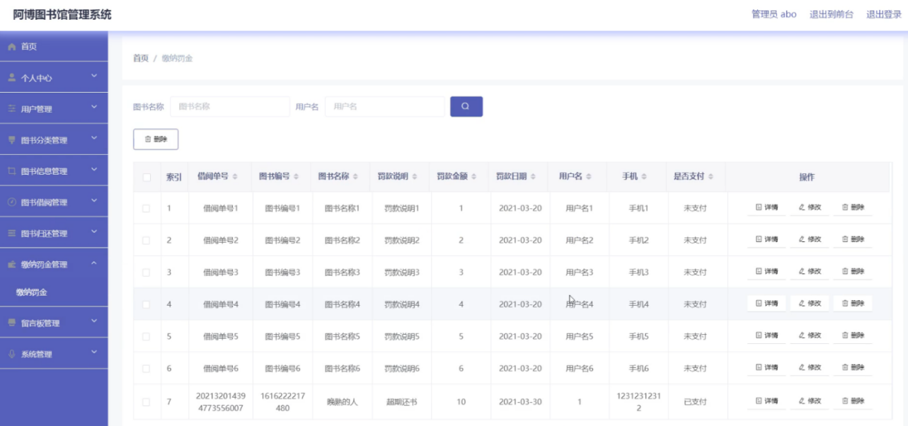

# springboot032-基于SpringBoot的阿博图书馆管理系统

>  博主介绍：
>  Hey，我是程序员Chaers，一个专注于计算机领域的程序员
>  十年大厂程序员全栈开发‍ 日常分享项目经验 解决技术难题与技术推荐 承接各类网站设计，小程序开发，毕设等。
>  【计算机专业课程设计，毕业设计项目，Java，微信小程序，安卓APP都可以做，不仅仅是计算机专业，其它专业都可以】

## 3000套系统可挑选，获取链接：https://chaerspol.github.io/

<b>QQ【获取完整源码】：674456564</b>

<b>QQ群【获取完整源码】：1058861570</b>

### 系统架构

> 前端：html | js | css | jquery | vue
>
> 后端：springboot | mybatis
> 
> 环境：jdk1.8+ | mysql | maven

# 一、内容包括
包括有  项目源码+项目论文+数据库源码+答辩ppt+远程调试成功

# 二、运行环境

> jdk版本：1.8 及以上； ide工具：IDEA； 数据库: mysql5.7及以上；编程语言: Java

# 三、需求分析

**3.1 可行性分析**

可行性分析是每开发一个项目必不可少的一部分，可行性分析可以直接影响一个系统的存活问题，针对开发意义进行分析，还有就是是否可以通过所开发的系统来弥补传统手工统计模式的不足，是否能够更好的解决阿博图书馆管理系统存在的问题等，通过对该阿博图书馆管理系统的开发设计，不仅能够逐步减少工作人员的工作量，而且还可以进行高效工作和管理。所以该系统的开发实现了最大的意义和价值，在系统完成后，利益是否大过于成本，是否能够达到预期效果，这些方面都要进行可行性分析，再通过分析之后，就可以决定是否开发此系统。该阿博图书馆管理系统的开发设计中，以下几点进行了可行性分析：技术可行性：通过Java技术的采用，由于该技术不断成熟，所以使用该技术设计阿博图书馆管理系统是具有可行性的。经济可行性：在开发过程中，系统完成后的利益是否大过于开发成本。操作可行性：阿博图书馆管理系统的开发设计中，方便用户的可操作性和实用性。

**3.1.1  技术可行性**

由于Java技术的不断成熟，所以它在本次阿博图书馆管理系统中是非常重要的，该系统的开发主要是基于服务端采用Java 、B/S结构和mysql数据库进行开发设计的。通过对这些技术进行使用，从而保证了系统的完整性和简单性。并且在数据库中保证数据的安全性和稳定性。在校时间我们对Java语言技术和mysql数据库技术进行了学习和交流，并且对软件测试也是简单的了解，然后根据这些管理方式我们可以做出一个简单的系统开发、检验和辨别。通过Java技术和Mysql数据库的相互配合开发出一个高效、稳定的阿博图书馆管理系统。

（1）轻量级系统，使用灵活：阿博图书馆管理系统，设计时，考虑到不同使用者的习惯，让系统比较轻量级，便于安装，也完成了系统所具备的所有功能，在以上基础上，通过系统测试与优化，让操作更加灵活。

（2）系统开发0成本：该阿博图书馆管理系统，以开源的Windows 7 操作系统为基础，采用Java技术编码开发，并使用MySQL轻量级数据库，没有多余的开发成本。

（3）覆盖范围：任何城市，都能安装使用本次设计的阿博图书馆管理系统，对系统使用方没有严格的规定，平台搭建好了就能使用。

**3.1.2 经济可行性** 

通过经济效益和社会价值来决定一个系统的存活问题，是否通过开发阿博图书馆管理系统来帮助管理员减少工作，是否能够方便用户的使用，假如开发的软件不能够实现成本节约和资源节约，并且还要投入大量的时间、经济和精力，那么这个系统的开发设计是没有意义和价值的，就不具备开发设计的条件。

**3.1.3 操作可行性**

此次开发的阿博图书馆管理系统登录界面是我们最常见的一种登录窗口进行造成的，只需通过电脑就可以登录访问，没有那些复杂的登录过程。该阿博图书馆管理系统主要是采用B/S结构、Java语言技术以及mysql数据库进行开发设计的，使得系统的开发更高效和稳定，也体现出来该系统的的现代化和规范化。用户可以轻松的进行学习，其系统主要特点就是易操作和易管理。

**3.2 系统性能分析**

1.系统功能完整性：根据系统每一个功能模块，都能够设计出当初的算法和代码，用户信息主要是以文字和表格的模式进行介绍。

2.系统运行分析：系统中的每一个功能都要有相应的代码和编写数据的关系。系统的物理的数据主要是通过需求分析和可行性分析进行分析和显示的。

3.界面设计：系统中的软件都是由不同的代码来进行处理和分析的，并且保证了系统界面的易操作性能。

4.安全分析：不同的角色要有不同的信息，所以我们登录系统时必须要使用自己的账号和密码进行登录，不能随意进行操作，这样才可以保证系统的安全性。

**3.3 系统功能需求分析**

任务需求分析是每个系统开发设计必不可少的一部分，系统质量的好坏可以直接影响系统的存活问题，所以我们必须要将任务需求分析做到位，阿博图书馆管理系统的设计在初期的分析是尤为重要的，通过任务分析可以更顺利的进行系统设计，并且保证了用户的满意度。

（1）用户功能需求

用户进入系统可以查看首页、个人中心、图书借阅管理、图书归还管理、缴纳罚金管理、我的收藏管理等操作。用户用例图如图所示。

（2）管理员功能需求

管理员登陆后，主要功能模块包括首页、个人中心、用户管理、图书分类管理、图书信息管理、图书借阅管理、图书归还管理、缴纳罚金管理、留言板管理、系统管理等功能。管理员用例图如图所示。

# 四、功能模块

该阿博图书馆管理系统功能结构图如图所示

# 五、部分效果图展示

图5-1管理员登录界面图【管理员登录，通过填写用户名、密码、角色进行登录，如图】

图5-2管理员功能界面图【管理员登录进入阿博图书馆管理系统页面可以查看首页、个人中心、用户管理、图书分类管理、图书信息管理、图书借阅管理、图书归还管理、缴纳罚金管理、留言板管理、系统管理等信息，如图】

图5-3用户管理界面图【用户管理，在用户管理列表可以查看用户名、姓名、性别、头像、手机、身份证等内容，还可以根据需要进行详情、修改或删除等操作，如图】

图5-4图书分类管理界面图【图书分类管理，在图书分类管理列表可以查看图书分类等信息，并可根据需要进行详情、修改或删除等操作，如图】

图5-5图书信息管理界面图【图书信息管理，在图书信息管理列表可以查看图书编号、图书名称、图书分类、图片、作者、出版社、图书状态、可借天数、可借数量等信息，并可根据需要进行详情、修改查看评论或删除等操作，如图】

图5-6图书借阅管理界面图【图书借阅管理，在图书借阅管理页面可以查看借阅单号、图书编号、图书名称、图书分类、图片、可借天数、可借数量、借阅日期、借阅天数、应还日期、借阅状态、用户名、姓名、手机、身份证、审核回复、审核状态、审核等内容，并且根据需要进行详情、修改等操作，如图】

图5-7缴纳罚金管理界面图【缴纳罚金管理，在缴纳罚金管理页面可以查看借阅单号、图书编号、图书名称、罚款说明、罚款金额、罚款日期、用户名、手机、是否支付等内容，并且根据需要进行详情、修改或删除等操作，如图】

图5-8轮播图管理界面图【轮播图；该页面为轮播图管理界面。管理员可以在此页面进行首页轮播图的管理，通过新建操作可在轮播图中加入新的图片，还可以对以上传的图片进行修改操作，以及图片的删除操作，如图】

图5-9前台首页界面图【阿博图书馆管理系统，在阿博图书馆管理系统页面可以查看首页、图书信息、公告信息、留言反馈、个人中心、后台管理等内容，如图】

图5-10图书信息界面图【图书信息，在图书信息页面可以查看图书编号、图书名称、图书分类、图片、作者、出版社、图书状态、可借天数、可借数量、点击次数等信息，进行借阅、点我收藏操作，如图】

 <b>完整文章</b>

 

## 3000套系统可挑选，获取链接：https://chaerspol.github.io/

<b>QQ【获取完整源码】：674456564</b>

<b>QQ群【获取完整源码】：1058861570</b>

